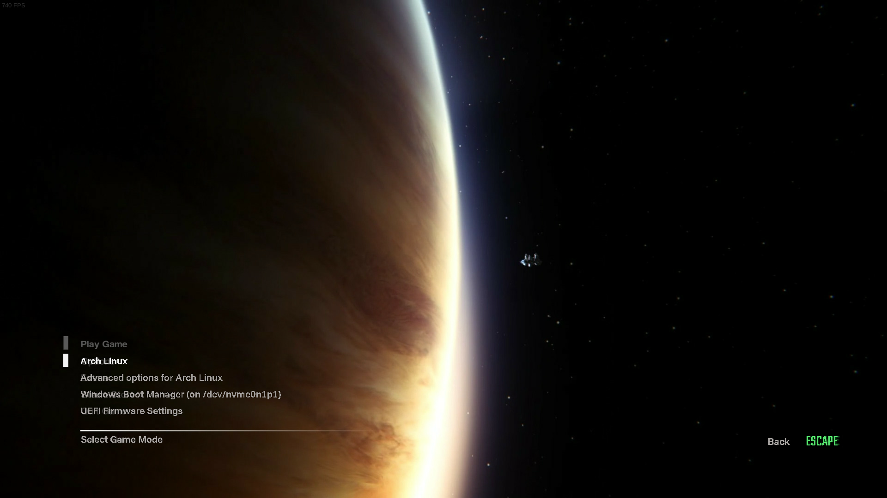

# Contributing to Space Isolation
Welcome and thanks for your interest in contributing to this GRUB theme!

## Support for Other Resolutions
Space Isolation is based on the main menu of [Alien: Isolation](https://www.gog.com/en/game/alien_isolation). Despite GRUB's limited font rendering, I've tried to match the original's font and text alignment as closely as possible. I did this by overlaying a screenshot of the main menu over a screenshot from [grub2-theme-preview](https://github.com/hartwork/grub2-theme-preview) as shown in the image below. However, I do not have access to higher resolutions than 2560x1440. If you decide to add support for another resolution, please make sure to check whether the text aligns with the original. Please open an issue before doing this, so two people won't be working on the same solution.

## Optimizations and Issues
Feel free to pull request or open an issue to add improvements to this repository like install scripts or general improvements to the organization of this repository.

## Documentation
Add installation guides for other distros.