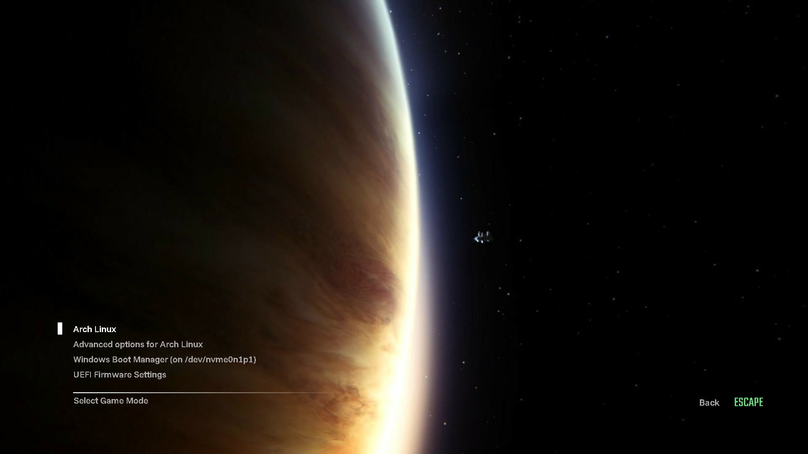

# Space Isolation
A GRUB theme based on the main menu of the 2014 survival horror game Alien: Isolation™.



## Installation
⚠️ This theme is a WIP **only supporting 2560x1440 and 1920x1080** resolutions. It will not look optimal on different resolutions. Feel free to add support for your resolutions using [this contribution guide](CONTRIBUTING).

### Arch Linux
1. Rename the directory with your resolution to `space-isolation`
2. Copy this directory to `/boot/grub/themes`
    ```zsh
    # cp -r /path/to/space-isolation /boot/grub/themes
    ```

2. In `/etc/default/grub`, set `GRUB_THEME=` to `/boot/grub/themes/space-isolation/theme.txt` and make sure `GRUB_TERMINAL_OUTPUT="gfxterm"`
3. Update GRUB
    ```zsh
    # grub-mkconfig -o /boot/grub/grub.cfg 
    ```

## Contribution
Feel free to contribute to this project using [this contribution guide](CONTRIBUTING.md). Leave a review on [Pling](https://www.pling.com/p/2296342/).
